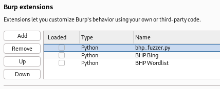

# PII Sniffer - Burp Suite Extension

**PII Sniffer** é uma extensão para o Burp Suite desenvolvida para detectar informações pessoais sensíveis (PII) em respostas HTTP interceptadas. A extensão identifica **CPFs**, **números de telefone**, **datas importantes** (como datas de nascimento) e **números de cartões de crédito**, facilitando a identificação de potenciais vazamentos de dados pessoais.

## Funcionalidades

- Detecta e valida CPFs em respostas HTTP.
- Busca e lista números de telefone.
- Detecta datas importantes no formato DD/MM/AAAA e MM/DD/AAAA.
- Identifica possíveis números de cartões de crédito com validação usando o algoritmo de Luhn.
- Gera relatórios sobre as ocorrências de PII encontradas, permitindo uma análise detalhada de possíveis vazamentos.

## Instalação

### Requisitos

- [Burp Suite](https://portswigger.net/burp) - Versão Community ou Professional
- [Jython Standalone](https://www.jython.org/download) - Para suportar extensões em Python no Burp Suite

### Passos para instalação

1. **Baixe a extensão**: Clone ou baixe este repositório para obter o arquivo `PII_Sniffer.py`.
2. **Instale o Jython no Burp**:
   - No Burp Suite, vá em **Extension > Settings**.

     
   
   - Na seção **Python Environment**, configure o caminho do Jython Standalone baixado (ex: `jython-standalone-2.7.4.jar`).

     

3. **Carregue a extensão**:
   - Vá para **Extender > Extensions**.
   - Clique em **Add**.

     
   
   - Selecione **Extension Type: Python**.
   - Em **Extension file**, selecione o arquivo `PII_Sniffer.py`.

     
     
5. **Confirmação da Instalação**:
   - Uma mensagem de confirmação (“PII Sniffer, Installation OK!!!”) deve aparecer na aba de saída do Burp Suite.

     

## Como Usar

1. **Intercepte e analise tráfego HTTP** com o Burp Suite ativado.
2. **Verifique o Output**:
   - A extensão automaticamente analisa as respostas HTTP em busca de CPFs, números de telefone, datas importantes e cartões de crédito.
   - Ao encontrar uma correspondência válida, como um CPF, telefone, data ou cartão de crédito, o item será exibido no log de saída.
3. **Resultados**:
   - A extensão exibe CPFs, números de telefone, datas e cartões de crédito identificados para que o analista possa verificar potenciais vazamentos de dados pessoais.

     
